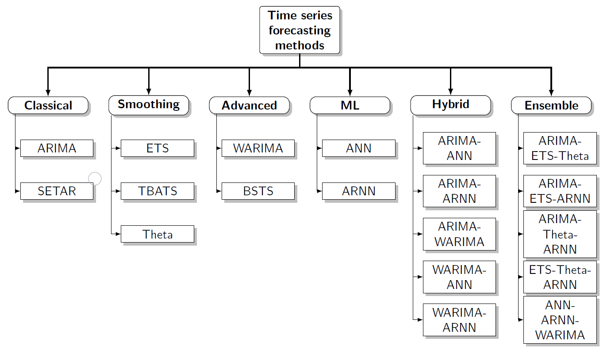
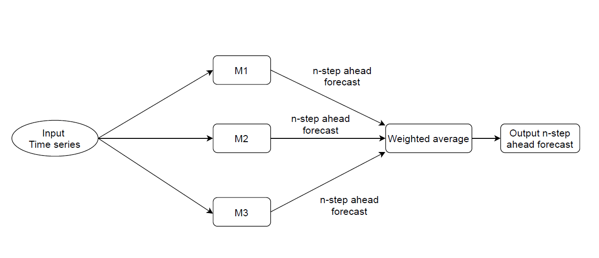
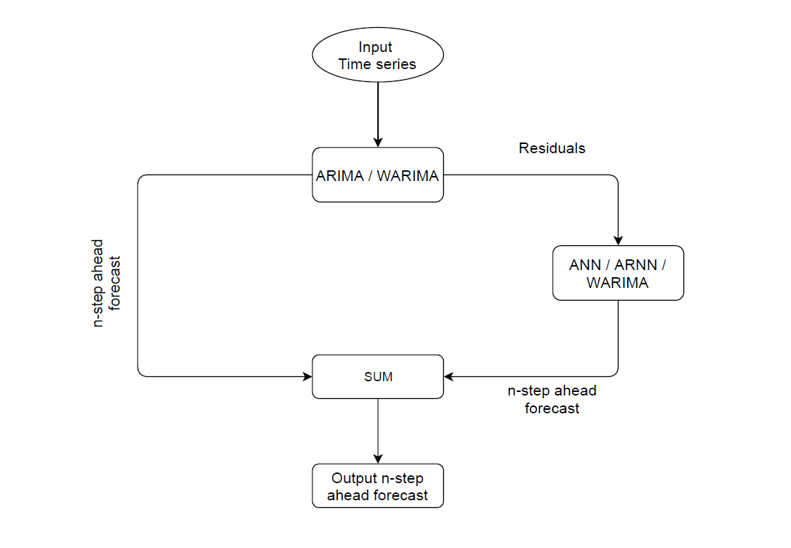
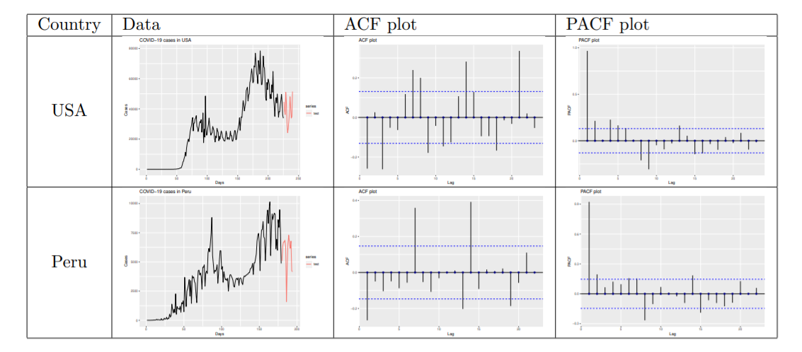
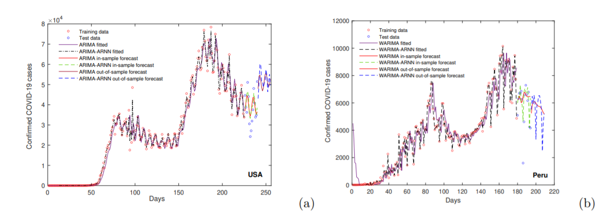

\title{Combining Statistical and Machine Learning Methods for Time Series Forecasting: Foundations and Applications}

\author{Tanujit Chakraborty and Indrajit Ghosh}

# Abstract
Machine Learning (ML) methods have been proposed in the past literature as alternatives to statistical ones for time series forecasting. Yet, scant evidence is available about their relative performance in terms of accuracy and computational requirements. More recently, various ensemble and hybrid methods combining both statistical and machine learning models were proposed in the forecasting literature. In the M4 forecasting competition, first and third places were achieved by a hybrid and an ensemble model respectively. The purpose of this paper is to provide a comprehensive study of the most popular individual, ensemble, and hybrid forecasting methods. After comparing the post-sample accuracy of several machine learning and combined methods with that of traditional statistical ones on some COVID-19 daily case data sets, we found that the ensemble and hybrid methods based on statistical and ML models are dominated across all accuracy measures used. The paper discusses the results, explains why the accuracy of ensemble and hybrid models is above that of individual ones. For the sake of repeatability and reproducibility of this study, open R codes and data sets are made publicly available at \url{https://github.com/indrajitg-r/Forecasting-COVID-19-cases}.

## Keywords: 
Statistical models; Machine learning models; Ensemble models; Hybrid models; Time Series Forecasting.

\section{Introduction}
Forecasting time series datasets have been a traditional research topic for decades, and various models have been developed to improve forecasting accuracy [1]. There are numerous methods available to forecast time series, including traditional statistical models and machine learning algorithms, providing many options for modelers working on various forecasting problems. However, selecting an appropriate single model for a particular time series can be challenging. Due to this, more compound models such as hybrid ARIMA-ANN [2] and ensemble models [3] were studied for more accurate forecasts. Both hybrid and combination approaches can outperform the single best component forecast in many instances. In hybrid ARIMA-ANN [2], an ARIMA model is applied to model the linear part of the data. In the next stage, an ANN model is employed to model the residuals of the ARIMA model. The hybrid model also reduces the model uncertainty which occurs in inferential statistics and forecasting time series. Based on this methodology, many hybrid models were examined to produce better forecast accuracy [4,5]. On the other hand, the combination of single models can be made with weighted averaging. The weights can be selected equally or proportionally to past model errors such that the weights sum to unity. But many more sophisticated combination schemes, have been suggested, such as unconstrained and even negative weights could be possible [3]. The simple equal-weights combination might appear woefully obsolete and probably non-competitive compared to the multitude of sophisticated combination approaches or advanced machine learning and neural network forecasting models, especially in the age of big data. However, such simple combinations can still be competitive [6]. The forecasting methods can be briefly reviewed and organized in the architecture shown in Figure 1.

Fig 1. A systemic view of the various forecasting methods to be used in this study

This review paper focuses on assessing popularly used single, hybrid, and ensemble forecasting models from an empirical perspective. The models are compared based on various accuracy measures when applied to COVID-19 daily case datasets. The findings of this paper will inform the practitioners by comparing various forecasting methods and discovering real challenges for pandemic forecasters. There is an extended version of this review article is publicly available at \url{https://arxiv.org/abs/2010.05079v1} and some of the hybrid models discussed here are directly taken from our previous works on time series forecasting, interested readers may see [4,5,7].

\section{ Forecasting Methods: Individual, Ensemble and Hybrid Models}
Time-series forecasting models work by taking a series of historical observations and extrapolating future patterns. These are great when the data are accurate; the future is similar to the past. Forecasting tools are designed to predict possible future alternatives and help current planning and decision making. There are essentially three general approaches to forecasting a time series: 1. Generating forecasts from an individual model; 2. Combining forecasts from many models (forecast model averaging); and 3. Hybrid experts for time series forecasting.

Single (individual) forecasting models are either traditional statistical methods or modern machine learning tools. We study ten popularly used single forecasting models from classical time series, advanced statistics, and machine learning literature. There has been vast literature on the forecast combinations motivated by the seminal work of Bates \& Granger [3] and followed by a plethora of empirical applications showing that combination forecasts are often superior to their counterparts. Combining forecasts using a weighted average is considered a successful way of hedging against the risk of selecting a misspecified model. A significant challenge is in choosing an appropriate set of weights, and many attempts to do this have been worse than simply using equal weights -- something that has become known as the "forecast combination puzzle". To overcome this, hybrid models became popular with the seminal work of [2] and further extended for epidemic forecasting in [4,5]. 

\subsection{Classical: Autoregressive integrated moving average (ARIMA) model}
The autoregressive integrated moving average (ARIMA) is one of the well-known linear models in time-series forecasting, developed in the early 1970s [8]. It is widely used to track linear tendencies in stationary time-series data. It is denoted by ARIMA($p,d,q$), where the three components have significant meanings. The parameters $p$ and $q$ represent the order of AR and MA models, respectively, and $d$ denotes the level of differencing to convert nonstationary data into stationary time series. ARIMA model can be mathematically expressed as follows:
\begin{align}
 y_t &= \alpha_{0} + \sum_{i=1}^{p} \beta_i y_{t-i} + \epsilon_t - \sum_{j=1}^q \alpha_j \epsilon_{t-j},   
\end{align}
where  $y_t$ denotes the actual value of the variable at time $t$, $\epsilon_t$ denotes the random error at time $t$, $\beta_i$ and $\alpha_j$ are the coefficients of the model. Some necessary steps to be followed for any given time-series dataset to build an ARIMA model are as follows:
\begin{itemize}
\item Identification of the model (achieving stationarity).
\item Use autocorrelation function (ACF) and partial ACF plots to select the AR and MA model parameters, respectively, and finally estimate model parameters for the ARIMA model.
\item The 'best-fitted forecasting model can be found using the Akaike Information Criteria (AIC) or the Bayesian Information Criteria (BIC). Finally, one checks the model diagnostics to measure its performance. 
\end{itemize}

\subsection{Classical: Self-exciting threshold autoregressive (SETAR) model}
As an extension of autoregressive model, Self-exciting threshold autoregressive (SETAR) model is used to model time series data, in order to allow for higher degree of flexibility in model parameters through a regime switching behaviour. Given a time-series data $y_t$, the SETAR model is used to predict future values, assuming that the behavior of the time series changes once the series enters a different regime. This switch from one to another regime depends on the past values of the series. The model consists of $k$ autoregressive (AR) parts, each for a different regime. The model is usually denoted as SETAR $(k,p)$ where $k$ is the number of threshold, there are $k+1$ number of regime in the model and $p$ is the order of the autoregressive part. For example, suppose an AR(1) model is assumed in both regimes, then a 2-regime SETAR model is given by [9]:
\begin{equation} 
\begin{split}
y_t & = \phi_{0,1} + \phi_{1,1}y_{t-1} + \epsilon_t \; \; \text{if} \; \; y_{t-1} \leq c,  \\
 & = \phi_{0,2} + \phi_{1,2}y_{t-1} + \epsilon_t \; \; \text{if} \; \; y_{t-1} > c,
\end{split}
\end{equation}
where for the moment the $\epsilon_t$ are assumed to be an i.i.d. white noise sequence conditional upon the history of the time series and $c$ is the threshold value. The SETAR model assumes that the border between the two regimes is given by a specific value of the threshold variable $y_{t-1}$. 

\subsection{Smoothing: Exponential smoothing state space (ETS) model}
Exponential smoothing state space methods are very effective methods in the case of time series forecasting. Exponential smoothing was proposed in the late 1950s and has motivated some of the most successful forecasting methods. Forecasts produced using exponential smoothing methods are weighted averages of past observations, with the weights decaying exponentially as the observations get older. The ETS models belong to the family of state-space models, consisting of three-level components as an error component (E), a trend component (T), and a seasonal component(S). This method is used to forecast univariate time series data. Each model consists of a measurement equation that describes the observed data, and some state equations that describe how the unobserved components or states (level, trend, seasonal) change over time [10]. Hence, these are referred to as state-space models. The flexibility of the ETS model lies in its ability to trend and seasonal components of different traits. Errors can be of two types: Additive and Multiplicative. Trend Component can be any of the following: None, Additive, Additive Damped, Multiplicative and Multiplicative Damped. Seasonal Component can be of three types: None, Additive, and Multiplicative. Thus, there are 15 models with additive errors and 15 models with multiplicative errors. To determine the best model of 30 ETS models, several criteria such as Akaike's Information Criterion (AIC), Akaike's Information Criterion correction (AICc), and Bayesian Information Criterion (BIC) can be used [1]. 

\subsection{Smoothing: TBATS model}
The main objective of TBATS model is to deal with complex seasonal patterns using exponential smoothing. The name is acronyms for key features of the models: Trigonometric seasonality (T), Box-Cox Transformation (B), ARMA errors (A), Trend (T) and Seasonal (S) components. TBATS makes it easy for users to handle data with multiple seasonal patterns. This model is preferable when the seasonality changes over time [10]. TBATS models can be described as follows:
\begin{align}
    y_{t}^{(\mu)} &= l_{t-1} + \phi b_{t-1} + \sum_{i=1}^{T} s_{t-m_i}^{(i)} + d_t\\\nonumber
    l_{t} &= l_{t-1} + \phi b_{t-1} + \alpha d_t\\\nonumber
    b_{t} &= \phi b_{t-1} + \beta d_t\\\nonumber
    d_t &= \sum_{i=1}^{p} \psi_i d_{t-i} + \sum_{j=1}^{q} \theta_j e_{t-j} +  e_{t} ;\nonumber
\end{align}
where $y_{t}^{(\mu)}$ is the time series at time point $t$ (Box-Cox Transformed), $s_{t}^{(i)}$ is the $i$-th seasonal component, $l_t$ is the local level, $b_t$ is the trend with damping, $d_t$ is the ARMA$(p,q)$ process for residuals and $e_t$ as the Gaussian white noise.

\subsection{Smoothing: Theta model}
The 'Theta method' or 'Theta model' is a univariate time series forecasting technique that performed particularly well in M3 forecasting competition and of interest to forecasters [11]. The method decomposes the original data into two or more lines, called theta lines, and extrapolates them using forecasting models. Finally, the predictions are combined to obtain the final forecasts. The theta lines can be estimated by simply modifying the 'curvatures' of the original time series. This change is obtained from a coefficient, called $\theta$ coefficient, which is directly applied to the second differences of the time series:
\begin{equation}
	Y^{"}_{new}(\theta) = \theta  Y^{"}_{data},  
	\label{eqn1}
\end{equation}
where $ Y^{"}_{data}= Y_t - 2 Y_{t-1} + Y_{t-2}$ at time $t$ for $t=3,4,\cdots,n$ and $\{Y_1,Y_2,\cdots,Y_n\}$ denote the observed univariate time series. In practice, coefficient $\theta$ can be considered as a transformation parameter that creates a series of the same mean and slopes with that of the original data but having different variances. Now, Eqn. (\ref{eqn1}) is a second-order difference equation and has a solution of the following form:
\begin{equation}
	Y_{new}(\theta) = a_{\theta} + b_{\theta}(t-1) + \theta  Y_{t},  
	\label{eqn2}
\end{equation}
where $a_{\theta}$ and $b_{\theta}$ are constants and $t=1,2,\cdots,n$. Thus, $Y_{new}(\theta)$ is equivalent to a linear function of $Y_t$ with a linear trend added. The values of $a_{\theta}$ and $b_{\theta}$ are computed by minimizing the sum of squared differences:
\begin{equation}
	\displaystyle\sum_{i=1}^{t} \left[ Y_t - Y_{new}(\theta) \right]^2 = \displaystyle\sum_{i=1}^{t}\left[(1-\theta) Y_{t} - a_{\theta} - b_{\theta}(t-1) \right]^2.
	\label{eqn3}
\end{equation}
Forecasts from the Theta model are obtained by a weighted average of forecasts of $Y_{new}(\theta)$ for different values of $\theta$. Also, the prediction intervals and likelihood-based estimation of the parameters can be obtained based on a state-space model. 

\subsection{Advanced: Wavelet-based ARIMA (WARIMA) model}
Wavelet-based models are most suitable for nonstationary data, unlike standard ARIMA. Most epidemic time-series datasets are nonstationary; therefore, wavelet transforms are used as a forecasting model for these datasets [5]. When conducting wavelet analysis in the context of time series analysis, the selection of the optimal number of decomposition levels is vital to determine the performance of the model in the wavelet domain. The following formula for the number of decomposition levels, $WL=int[log(n)]$, is used to select the number of decomposition levels, where $n$ is the time-series length. The wavelet-based ARIMA (WARIMA) model transforms the time series data by using a hybrid maximal overlap discrete wavelet transform (MODWT) algorithm with a ‘haar’ filter. Daubechies wavelets can produce identical events across the observed time series in so many fashions that most other time series prediction models cannot recognize. The necessary steps of a wavelet-based forecasting model, defined by [12], are as follows. Firstly, the Daubechies wavelet transformation and a decomposition level are applied to the nonstationary time series data. Secondly, the series is reconstructed by removing the high-frequency component, using the wavelet denoising method. Lastly, an appropriate ARIMA model is applied to the reconstructed series to generate out-of-sample forecasts of the given time series data. Wavelets were first considered as a family of functions by Morlet, constructed from the translations and dilation of a single function, which is called ''Mother Wavelet". These wavelets are defined as follows:
\begin{align}
  \phi_{m,n}(t) &= \frac{1}{\sqrt{|m|}} \phi\left(\frac{t-n}{m}\right); \; \; m, n \in \mathcal{R},  
\end{align}
where the parameter $m \; (\neq 0)$ is denoted as the scaling parameter or scale, and it measures the degree of compression. The parameter $n$ is used to determine the time location of the wavelet, and it is called the translation parameter. If the value $|m| < 1$, then the wavelet in $m$ is a compressed version (smaller support is the time domain) of the mother wavelet and primarily corresponds to higher frequencies, and when $|m| > 1$, then $\phi_(m,n) (t)$ has larger time width than $\phi(t)$ and corresponds to lower frequencies. Hence wavelets have time width adopted to their frequencies, which is the main reason behind the success of the Morlet wavelets in signal processing and time-frequency signal analysis. 

\subsection{Advanced: Bayesian structural time series (BSTS) model}
Bayesian Statistics has many applications in the field of statistical techniques such as regression, classification, clustering, and time series analysis. Scott and Varian [13] used structural time series models to show how Google search data can be used to improve short-term forecasts of economic time series. In the structural time series model, the observation in time $t$, $y_t$ is defined as follows:
\begin{align}
   y_t &= X_{t}^{T}\beta_t + \epsilon_t 
\end{align}
where $\beta_t$ is the vector of latent variables, $X_t$ is the vector of model parameters, and $\epsilon_t$ are assumed follow Normal distributions with zero mean and $H_t$ as the variance. In addition, $\beta_t$ is represented as follows: 
\begin{align}
    \beta_{t+1} &= S_t \beta_t + R_t \delta_t,
\end{align}
where $\delta_t$ are assumed to follow Normal distributions with zero mean and $Q_t$ as the variance. Gaussian distribution is selected as the prior of the BSTS model since we use the occurred frequency values ranging from 0 to $\infty$. 

\subsection{ML: Artificial neural networks (ANN) model}
Forecasting with artificial neural networks (ANN) has received increasing interest in various research and applied domains in the late 1990s. It has been given special attention in epidemiological forecasting. Multi-layered feed-forward neural networks with back-propagation learning rules are the most widely used models with applications in classification and prediction problems. There is a single hidden layer between the input and output layers in a simple feed-forward neural net, and where weights connect the layers. Denoting by $\omega_{ji}$ the weights between the input layer and hidden layer and $\nu_{kj}$ denotes the weights between the hidden and output layers. Based on the given inputs $x_i$, the neuron's net input is calculated as the weighted sum of its inputs. The output layer of the neuron, $y_j$, is based on a sigmoidal function indicating the magnitude of this net-input. For the $j^{th}$ hidden neuron, the calculation for the net input and output are:
\begin{align}
    net_j^h &= \displaystyle\sum_{i=1}^{n} \omega_{ji} x_i \\
    y_j &=f(net_j^h).
\end{align}
For the $k^{th}$ output neuron:
\begin{align}
    net_k^o &= \displaystyle\sum_{j=1}^{J+1} \nu_{kj} y_j \\
    o_k &= f(net_k^o),
\end{align}
where $f(net)= \frac{1}{1+e^{-\lambda net}}$ with $\lambda \in (0,1)$ is a parameter used to control the gradient of the function and $J$ is the number of neurons in the hidden layer. The back-propagation [14] learning algorithm is the most commonly used technique in ANN. In the error back-propagation step, the weights in ANN are updated by minimizing 
\begin{align}
   E &= \frac{1}{2P} \displaystyle\sum_{p=1}^{P} \displaystyle\sum_{k=1}^{K} (d_{pk}-O_{pk})^2, 
\end{align}
where, $d_{pk}$ is the desired output of neuron $k$ and for input pattern $p$. The common formula for number of neurons in the hidden layer is $h=\frac{(i+j)}{2} + \sqrt{d}$, for selecting the number of hidden neurons, where $i$ is the number of output $y_j$ and $d$ denotes the number of $i$ training patterns in the input $x_i$. 

\subsection{ML: Autoregressive neural network (ARNN) model}
Autoregressive neural network (ARNN) received attention in time series literature in the late 1990s [15]. The architecture of a simple feedforward neural network can be described as a network of neurons arranged in the input layer, hidden layer, and output layer in a prescribed order. Each layer passes the information to the next layer using weights that are obtained using a learning algorithm. ARNN model is a modification to the simple ANN model specially designed for prediction problems of time-series datasets. ARNN model uses a pre-specified number of lagged values of the time series as inputs and the number of hidden neurons in its architecture is also fixed [10]. ARNN($p,k$) model uses $p$ lagged inputs of the time series data in a one hidden layered feedforward neural network with $k$ hidden units in the hidden layer. Let $\underline{x}$ denotes a $p$-lagged inputs and $f$ is a neural network of the following architecture:
\begin{equation}
	f(\underline{x}) = c_{0} + \displaystyle \sum_{j=1}^{k} w_j \phi \left( a_j + b_{j} '\underline{x} \right);
	\label{eqn4}
\end{equation}
where $c_0, a_j, w_j$ are connecting weights, $b_j$ are $p$-dimensional weight vector and $\phi$ is a bounded nonlinear sigmoidal function (e.g., logistic squasher function or tangent hyperbolic activation function). These Weights are trained using a gradient descent backpropagation [14]. Standard ANN faces the dilemma to choose the number of hidden neurons in the hidden layer and the optimal choice is unknown. But for the ARNN model, we adopt the formula $k = [(p+1)/2]$ for non-seasonal time series data where $p$ is the number of lagged inputs in an autoregressive model [10]. 

\subsection{Ensemble forecasting models}
The idea of ensemble time series forecasts was given by Bates and Granger (1969) in their seminal work [3]. Forecasts generated from ARIMA, ETS, Theta, ARNN, WARIMA can be combined with equal weights, weights based on in-sample errors, or cross-validated weights. In the ensemble framework, cross-validation for time series data with user-supplied models and forecasting functions is also possible to evaluate model accuracy [6]. Combining several candidate models can hedge against an incorrect model specification. Bates and Granger(1969) [3] suggested such an approach and observed, somewhat surprisingly, that the combined forecast can even outperform the single best component forecast. While combination weights selected equally or proportionally to past model errors are possible approaches, many more sophisticated combination schemes, have been suggested. For example, rather than normalizing weights to sum to unity, unconstrained and even negative weights could be possible. The simple equal-weights combination might appear woefully obsolete and probably non-competitive compared to the multitude of sophisticated combination approaches or advanced machine learning and neural network forecasting models, especially in the age of big data. However, such simple combinations can still be competitive, particularly for pandemic time series [6]. A flow diagram of the ensemble method is presented in Figure 2.

The ensemble method by [3] produces forecasts out to a horizon $h$ by applying a weight $w_m$ to each $m$ of the $n$ model forecasts in the ensemble. The ensemble forecast $f(i)$ for time horizon $1 \leq i \leq h$ and with individual component model forecasts $f_m(i)$ is then 
\begin{align}
  f(i) &= \displaystyle\sum_{m=1}^{n} w_m f_m(i).  
\end{align}
The weights can be determined in several ways (for example, supplied by the user, set equally, determined by in-sample errors, or determined by cross-validation). 

Fig. 2 Flow diagram of the ensemble model where M1, M2, and M3 are three different univariate time series models

\subsection{Hybrid forecasting models}
The idea of hybridizing time series models and combining different forecasts was first introduced by [2] and further extended by [4,5,7]. The mathematical formulation of the proposed hybrid model ($Z_t$) is as follows:
\begin{align}
    Z_t &= L_t + N_t,
\end{align}
where $L_t$ is the linear part and $N_t$ is the nonlinear part of the hybrid model. We can estimate both $L_t$ and $N_t$ from the available time-series data. Let $\hat{L_t}$ be the forecast value of the linear model (e.g., ARIMA) at time $t$ and $\epsilon_{t}$ represent the error
residuals at time $t$, obtained from the linear model. Then, we write
\begin{align}
	\epsilon_{t} & = Z_t - \hat{L_t}.
\end{align}
These left-out residuals are further modeled by a nonlinear model (e.g., ANN or ARNN) and can be represented as follows:
\begin{align}
	\epsilon_{t} &= f(\epsilon_{t-1}, \epsilon_{t-2}, . . . , \epsilon_{t-p}) + \varepsilon_t,
\end{align}
where $f$ is a nonlinear function, and the modeling is done by the nonlinear ANN or ARNN model as defined in Eqn. (\ref{eqn4}) and $\varepsilon_t$ is supposed to be the random shocks. Therefore, the combined forecast can be obtained as follows:
\begin{align}
	\hat{Z_t} &= \hat{L_t} + \hat{N_t},
\end{align}
where $\hat{N_t}$ is the forecasted value of the nonlinear time series model. An overall flow diagram of the proposed hybrid model is given in Figure 3. In the hybrid model, a nonlinear model is applied in the second stage to re-model the left-over autocorrelations in the residuals, which the linear model could not model. Thus, this can be considered as an error re-modeling approach. This is important because due to model misspecification and disturbances in the pandemic rate time series, the linear models may fail to generate white noise behavior for the forecast residuals. Thus, hybrid approaches eventually can improve the predictions for the epidemiological forecasting problems, as shown in [4,5]. These hybrid models only assume that the linear and nonlinear components of the epidemic time series can be separated individually. 

Fig. 3 Flow diagram of the hybrid forecasting model

\section{Applications to real-world data sets} \label{sec:experimental_analysis}
\subsection{Datasets}
For illustration, two time-series COVID-19 datasets for the USA and Peru are considered for assessing various individual, ensemble, and hybrid forecasting models. The datasets are mostly nonlinear, nonstationary, and non-Gaussian in nature. We have used root mean square error (RMSE), mean absolute error (MAE), mean absolute percentage error (MAPE), and symmetric MAPE (SMAPE) to evaluate the predictive performance of the models used in this study. Since the number of data points in both datasets is limited, advanced deep learning techniques will over-fit the datasets. We use publicly available datasets to compare various forecasting frameworks. COVID-19 cases of these countries were collected from \url{https://ourworldindata.org/}. The USA datasets have 240 observations out of which the last 15 observations are kept as test samples and for the Peru data set we considered a total of 194 observations and out of which the last 15 days data sets are kept as test samples. 

\subsection{Accuracy metrics}
We used four popular accuracy metrics to evaluate the performance of different time series forecasting models. The expressions of these metrics are given below.
\begin{align}
    RMSE &= \sqrt{\frac{1}{n} \sum_{i=1}^n (y_i - \hat{y}_i)^2} ; \;
    MAE = \frac{\displaystyle 1}{\displaystyle n} \sum_{i=1}^n |y_i - \hat{y}_i|;\\\nonumber
    MAPE &= \frac{1}{n} \sum_{i=1}^n |\frac{\hat{y}_i - y_i}{y_i}| \times 100 ; \;
    SMAPE =\frac{1}{n} \sum_{i=1}^n \frac{|\hat{y}_i - y_i|}{(|\hat{y}_i|+|y_i|)/2} \times 100 ; 
\end{align}
where $y_i$ are actual series values, $\hat{y}_i$ are the predictions by different models and $n$ represent the number of data points of the time series. The models with least accuracy metrics is the best forecasting model.

\begin{table}[H]
	\centering 
	\begin{tabular}{|c|c|c|}
		\hline
	    Model & R function & R package \\ \hline
		ARIMA & auto.arima & forecast \\ \hline
		ETS & ets & forecast   \\ \hline
		SETAR & setar & tsDyn  \\ \hline
		TBATS & tbats & forecast  \\ \hline
		Theta & thetaf & forecast  \\ \hline
		ANN & mlp & nnfor  \\ \hline
		ARNN & nnetar & forecast  \\ \hline
		WARIMA & WaveletFittingarma & WaveletArima  \\ \hline
		BSTS & bsts & bsts  \\ \hline
		Ensemble models & hybridModel & forecastHybrid  \\ \hline
		Hybrid models & Our GitHub Repository & \url{https://github.com/indrajitg-r/COVID}  \\ \hline
	\end{tabular}
	\label{r}
\end{table}
Table 1. R functions and packages for implementation.

\subsection{Analysis of results}
This subsection is devoted to the experimental analysis of confirmed COVID-19 cases using different time series forecasting models. The test period is chosen to be 15 days, whereas the rest of the data is used as training data. In the first columns of Fig 4, we present training data and test data for the USA and Peru. The autocorrelation function (ACF) and partial autocorrelation function (PACF) plots are also depicted for the training period of each of the five countries in Fig 4. ACF and PACF plots are generated after applying the required number of differencing of each training data using the r function 'diff'. The required order of differencing is obtained by using the R function 'ndiffs' which estimates the number of differences required to make a given time series stationary. The integer-valued order of difference is then used as the value of '$d$' in the ARIMA$(p,d,q)$ model. The other two parameters '$p$' and '$q$' of the model are obtained from ACF and PACF plots respectively (see Fig 4). However, we choose the 'best' fitted ARIMA model using the AIC value for each training dataset. Fig 4 presents the training data (black-colored) and test data (red-colored) and corresponding ACF and PACF plots for the five time-series datasets. 
Further, we checked all the forecasting models as competitors for the short-term forecasting of COVID-19 confirmed cases. 15-days-ahead forecasts were generated for each model, and accuracy metrics were computed to determine the best predictive models. From the previously discussed single models, we choose the best one based on the accuracy metrics. On the other hand, one hybrid/ensemble model is selected from the rest of the ten models. Table 1 gives the essential details about the functions and packages required for implementation. 

Fig. 4 Pandemic datasets and corresponding ACF, PACF plots with 15-days test data

For the USA data set, among the single models, ARIMA(2,1,4) performs best in terms of accuracy metrics for 15-days ahead forecasts. TBATS and ARNN(16,8) also have competitive accuracy metrics. The Hybrid ARIMA-ARNN model improves the earlier ARIMA forecasts and has the best accuracy among all hybrid/ensemble models (see Table 2). Hybrid ARIMA-WARIMA also does a good job and improves ARIMA model forecasts. In-sample and out-of-sample forecasts obtained from ARIMA and hybrid ARIMA-ARNN models are depicted in Fig. 5 (a). For the Peru data set, WARIMA performs better than other single models for 15-days ahead forecasts. Hybrid WARIMA-ARNN model improves the WARIMA forecasts and has the best accuracy among all hybrid/ensemble models (see Table 3). In-sample and out-of-sample forecasts obtained from WARIMA and hybrid WARIMA-ARNN models are depicted in Fig. 5(b).  

Fig. 5 Plots of (a) 15-days ahead forecast results for USA COVID-19 data obtained using ARIMA and hybrid ARIMA-ARNN models. (b) 15-days ahead forecast results for Peru COVID-19 data obtained using WARIMA and hybrid WARIMA-ARNN models.

\begin{table}
	\begin{tabular}{|c|c|c|c|c|}
		\hline
		\multirow{2}{*}{Model} & \multicolumn{4}{c|}{15-days ahead forecast} 
		\\ \cline{2-5} & RMSE & MAE & MAPE & SMAPE \\ \hline
		ARIMA(2,1,4) & 7187.02 & 6094.95 & 16.89 & 16.07 \\ \hline
		ETS(A,N,N) & 8318.73 & 6759.65 & 17.82 & 17.86  \\ \hline
		SETAR & 8203.21 & 6725.96 & 18.19 & 17.77 \\ \hline
		TBATS & 7351.04 & 6367.46 & 17.86 & 16.73 \\ \hline
		Theta & 8112.22 & 6791.52 & 18.51 & 17.95 \\ \hline
		ANN & 9677.105 & 8386.223 & 25.15 & 21.69 \\ \hline
		ARNN(16,8) & 7633.92 & 6647.18 & 19.75 & 17.42 \\ \hline
		WARIMA & 9631.98 & 8182.84 & 21.09 & 22.21 \\ \hline
		BSTS & 10666.15 & 8527.72 & 20.91 & 23.26 \\ \hline
		Hybrid ARIMA-ANN & 7113.72 & 6058.29 & 16.90 & 15.99 \\ \hline
		Hybrid ARIMA-ARNN & \textbf{5978.04} & \textbf{4650.89} & \textbf{13.22} & \textbf{12.45} \\ \hline 
		Hybrid ARIMA-WARIMA & 6582.93 & 5217.023 & 14.33 & 13.80 \\ \hline
		Hybrid WARIMA-ANN & 10633.97 & 8729.11 & 21.85 & 24.22 \\ \hline
		Hybrid WARIMA-ARNN & 9558.34 & 8138.71 & 21.05 & 22.05 \\ \hline
		Ensemble ARIMA-ETS-Theta & 7602.06 & 6388.96 & 17.32 & 16.89 \\ \hline
		Ensemble ARIMA-ETS-ARNN & 7012.95 & 6184.23 & 18.09 & 16.45 \\ \hline
		Ensemble ARIMA-Theta-ARNN & 6933.88 & 6054.97 & 17.42 & 16.07 \\ \hline
		Ensemble ETS-Theta-ARNN &  7044.20 & 5950.40 & 16.97 & 15.82 \\ \hline
		Ensemble ANN-ARNN-WARIMA & 7437.21 & 6465.18 & 18.66 & 17.11 \\ \hline
	\end{tabular}
\end{table}
Table 2 Performance metrics with 15 days-ahead test set for USA and best results are embolden

\begin{table}
	\begin{tabular}{|c|c|c|c|c|}
		\hline
		\multirow{2}{*}{Model} & \multicolumn{4}{c|}{15-days ahead forecast} 
		\\ \cline{2-5} & RMSE & MAE & MAPE & SMAPE \\ \hline
		ARIMA(1,1,1) with drift & 2275.49 & 1686.84 & 49.97 & 28.99 \\ \hline
		ETS(M,A,N) & 1689.96 & 1189.05 & 31.89 & 23.15  \\ \hline
		SETAR & 1935.78 & 1286.56 & 41.57 & 23.71 \\ \hline
		TBATS & 1944.26 & 1301.07 & 41.72 & 24.06 \\ \hline
		Theta & 1831.88 & 1146.27 & 38.37 & 21.92 \\ \hline
		ANN & 1771.59 & 1211.24 & 38.89 & 22.75 \\ \hline
		ARNN(15,8) & 2564.65 & 2244.78 & 57.13 & 35.78 \\ \hline
		WARIMA & 1659.24 & 1060.67 & 35.22 & 20.85\\ \hline
		BSTS & 1740.18 & 1082.16 & 36.48 & 21.07 \\ \hline
		Hybrid ARIMA-ANN & 2189.18 & 1596.80 & 47.93 & 27.96 \\ \hline
		Hybrid ARIMA-ARNN & 1646.88 & 1244.03 & 34.95 & 23.43 \\ \hline
		Hybrid ARIMA-WARIMA & 2082.15 & 1385.87 & 43.93 & 24.99 \\ \hline
		Hybrid WARIMA-ANN & 1560.68 & 1206.92 & 34.11 & 23.43 \\ \hline
		Hybrid WARIMA-ARNN & \textbf{1121.10} & \textbf{827.90} & \textbf{23.33} & \textbf{17.46} \\ \hline
		Ensemble ARIMA-ETS-Theta & 1677.24 & 1040.93 & 35.50 & 20.46 \\ \hline
		Ensemble ARIMA-ETS-ARNN & 1748.39 & 1185.23 & 38.18 & 22.48 \\ \hline
		Ensemble ARIMA-Theta-ARNN & 1801.56 & 1324.73 & 39.97 & 24.39 \\ \hline
		Ensemble ETS-Theta-ARNN & 1613.15 & 1048.04 & 34.76 & 20.62 \\ \hline
		Ensemble ANN-ARNN-WARIMA & 1864.99 & 1329.83 & 41.16 & 24.43 \\ \hline
	\end{tabular}
\end{table}
Table 3 Performance metrics with 15 days-ahead test set for Peru and best results are embolden

\section{Discussions}\label{sec:discussions}
In this study, we assessed several individuals and combined statistical learning models on the confirmed cases of COVID-19 data sets for the USA and Peru. These COVID-19 daily cases datasets mostly exhibit nonlinear and nonstationary behavior. The empirical findings suggest that our proposed hybrid models [4,5,7] outperformed all the individual and ensemble models in COVID-19 forecasting. The future forecasts obtained from models with the best accuracy will be useful in decision and policy makings for government officials and policymakers to allocate adequate health care resources for the coming days in responding to the crisis. 

Considering the scope of this study, we present a set of challenges of pandemic forecasting (short-term) with the available forecasting tools presented in this review paper. To obtain better out-of-sample forecasts of daily COVID-19 cases, it is necessary to (I) collect more data on the factors that contribute to daily confirmed cases of COVID-19; (II) model the entire predictive distribution, with particular focus on accurately quantifying uncertainty; and (III) continuously monitor the performance of any model against real data and either re-adjust or discard models based on accruing evidence. Epidemiological estimates and compartmental models can be useful for long-term pandemic trajectory prediction, but they often assume some unrealistic assumptions. Thus, future research is needed to collect, clean, and curate data and develop a coherent approach to evaluate the suitability of models concerning COVID-19 predictions and forecast uncertainties.

## References
[1] Hyndman  R,  Koehler  AB,  Ord  JK,  Snyder  RD  (2008)  Forecasting  with  exponentialsmoothing: the state space approach. Springer Science & Business Media

[2] Zhang GP (2003) Time series forecasting using a hybrid arima and neural network model.Neurocomputing 50:159–175

[3] Bates JM, Granger CW (1969) The combination of forecasts. Journal of the OperationalResearch Society 20(4):451–468

[4] Chakraborty T, Chattopadhyay S, Ghosh I (2019) Forecasting dengue epidemics using ahybrid methodology. Physica A: Statistical Mechanics and its Applications p 121266

[5] Chakraborty T, Ghosh I (2020) Real-time forecasts and risk assessment of novel coron-avirus (covid-19) cases: A data-driven analysis. Chaos, Solitons and Fractals 135

[6] Shaub D (2020) Fast and accurate yearly time series forecasting with forecast combina-tions. International Journal of Forecasting 36(1):116–120

[7] Chakraborty T, Chakraborty AK, Biswas M, Banerjee S, Bhattacharya S (2020) Unem-ployment rate forecasting: A hybrid approach. Computational Economics pp 1–19

[8] Box GE, Jenkins GM, Reinsel GC, Ljung GM (2015) Time series analysis: forecasting andcontrol. John Wiley & Sons

[9] Franses PH, Van Dijk D, et al (2000) Non-linear time series models in empirical finance.Cambridge university press

[10] Hyndman RJ, Athanasopoulos G (2018) Forecasting: principles and practice. OTexts

[11] Assimakopoulos V, Nikolopoulos K (2000) The theta model: a decomposition approach toforecasting. International journal of forecasting 16(4):521–530

[12] Aminghafari  M,  Poggi  JM  (2007)  Forecasting  time  series  using  wavelets.  InternationalJournal of Wavelets, Multiresolution and Information Processing 5(05):709–724

[13] Scott SL, Varian HR (2014) Predicting the present with bayesian structural time series.International Journal of Mathematical Modelling and Numerical Optimisation 5(1-2):4–23

[14] Rumelhart DE, Hinton GE, Williams RJ (1985) Learning internal representations by errorpropagation. Tech. rep., California Univ San Diego La Jolla Inst for Cognitive Science

[15] Faraway J, Chatfield C (1998) Time series forecasting with neural networks: a comparativestudy using the air line data. Journal of the Royal Statistical Society: Series C (AppliedStatistics) 47(2):231–250